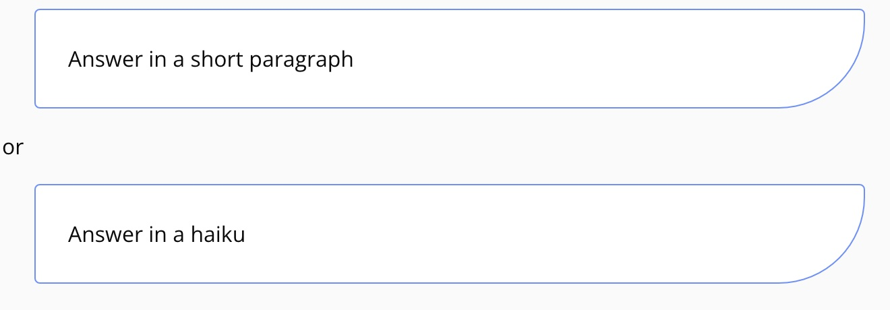
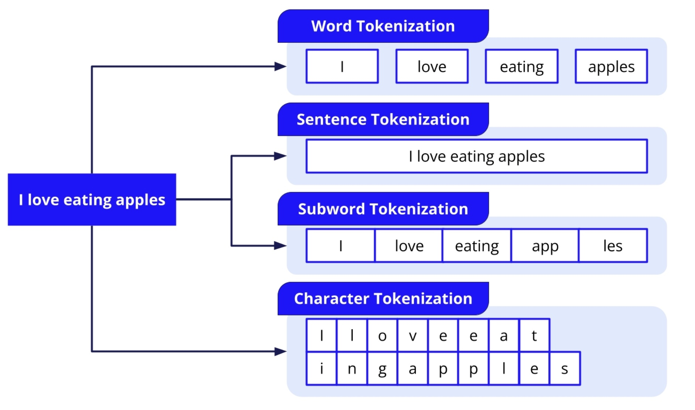
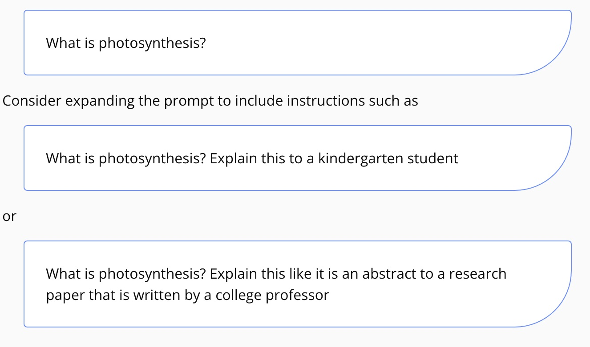
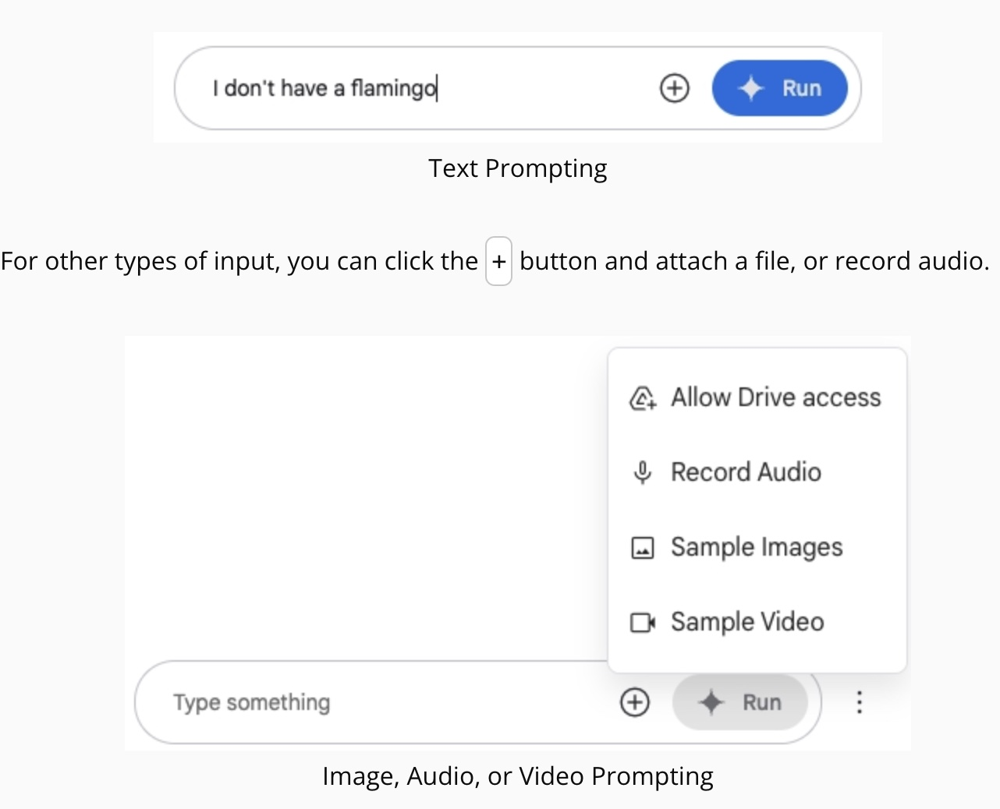
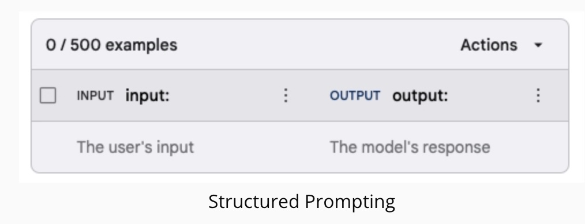
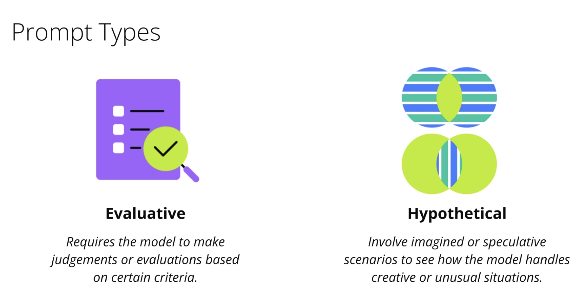

# 2-Prompting-Google-IA
1. [Introduction](#schema1)
2. [Prompting Methods](#schema2)
3. [Advanced Prompting Methods](#schema3)
4. [Appendix: More Types of Prompts](#schema4)

[DOC](#schemadoc)

## 1. Introduction

### Introduction
Prompts are the text and multimedia inputs that are sent to LLMs. They can be more flexible and expressive than code, but also can produce unpredictable results. Prompt engineering means refining prompts to yield the best and most consistent outcomes.

Google AI Studio is a standalone environment for experimenting with Gemini models. It allows you to try different versions of prompts and also to test out fine-tuning datasets.

In this video, we cover several prompt engineering techniques and how to apply them in Google AI Studio. Feel free to follow along at aistudio.google.com/(opens in a new tab)

### Zero-Shot and Few-Shot Prompts
A "shot" is the number of examples you provide in your prompt.

Because the Gemini models have been pre-trained on large quantities of data, a zero-shot prompt may be enough. In other words, you may be able to ask a question without providing any examples, and get the correct response back.

If you are asking the model to perform a task that was not well-represented in the training data, you may want to provide a few examples of valid inputs and outputs. This is called a few-shot prompt.

You also may hear the terms one-shot prompt and k-shot prompt. A one-shot prompt means that exactly one example is provided, rather than a few. A k-shot prompt means that a specific number ("k") of examples are provided.

### System Instructions (Beta)
System instructions are used to customize the tone or style of all text generated by the model, across all prompts that are passed in. For example, the system instructions could be:

### Token Counts
Tokens are the basic units of inputs and outputs for LLMs. They can be defined in various different ways.

As mentioned previously, Gemini models have very large context windows of around 1 million tokens. Google AI Studio shows a "Token Count" that represents the number of tokens of the context window that have been used up.

### Temperature
Temperature determines the level of randomness used in the text generation process. A higher temperature will be more creative, while a lower temperature will be more deterministic.

Note that even at a temperature of 0, you will get somewhat different results each time the model generates text, because text generation is fundamentally random.

### Stop Sequence
A stop sequence tells the model that it should stop generating text once it generates a particular sequence of characters. This is helpful if you want to limit the model's output to a given length or topic.

### Safety Settings
Safety settings prevent the model from producing certain types of harmful content. You may see a "No Content" message if you send a prompt that is blocked by the safety settings.

## 2. Prompting Methods

### Prompt Tuning
Try adding additional instructions to the prompt to help generate the text that you want. For example, if you're starting with the prompt

### Multimodal Prompts
Gemini models are able to take in prompts in various different formats.

The most basic is the text prompt, which can be written directly into the text box on the chat interface.

You can also add a text prompt that is sent at the same time as an image, audio, or video prompt.

### Structured Prompting
Structured prompting uses a different interface in Google AI Studio. Instead of entering prompts in a chat interface, you specify input-output pairs. Then later, when you provide additional inputs, Gemini will produce new outputs that resemble the specified ones.

## 3. Advanced Prompting Methods

### When to Use Chat vs. Structured Prompts
Chat prompts are best when the format of the inputs and outputs is conversational, and the structure is less important.

Structured prompts are best when the outputs must follow a specific format. For example, if the outputs must be in JSON format in order to be fed into a separate code system, then a structured prompt would be best. When compared with written instructions, a concrete list of examples can often be less ambiguous and also teach the model about implicit requirements that you might not think to mention in a chat prompt.

### Chain-of-Thought Prompts
Chain-of-thought prompts are a type of prompt where you ask the model to explain its logic step by step. Especially in tasks related to math or logic, this may produce better model performance. It can also help you to understand how and why the model is making a particular mistake.

The chain-of-thought technique can be implemented using a zero-shot prompt, where you simply add the phrase "Explain your answer step by step" to the prompt, or can be implemented using a k-shot prompt where you include examples of step-by-step reasoning. The example demonstrated in the video was a one-shot prompt for solving a math word problem.

### Sharing Prompts
Sharing prompts in Google AI Studio works the same way as sharing any other file stored in Google Drive. Once you grant AI Studio access to Drive, you'll be able to save your prompts there. Then you can click the "Share" button to open the file sharing dialog.

## 4. Appendix: More Types of Prompts

### Introduction
This page contains additional categories of prompts to consider. Feel free to browse them and refer back to them as you work through the remaining modules.

### High-Level Prompt Types
Before writing a prompt, first think about the overall purpose or intent of the prompt. This can largely be categorized as evaluative or hypothetical.

### Specific Prompt Types
Each of the following prompt types can work for either evaluative or hypothetical prompts.

- Direct query: Straightforward questions or requests for information
- Instructional: Direct model to perform a task or to follow a set of instructions
- Creative: Generate original and creative content
- Conversational: Engage in dialogue, often emulating human-like interactions
- Contextual: Provide background information for the model to consider
- Comparative: Ask the model to compare and contrast items, concepts, scenarios, etc.
### ReAct Prompting
ReAct is a prompting approach that combines reasoning and acting techniques to utilize external resources. Check out the resources linked below.

## DOC

https://ai.google.dev/gemini-api/docs/prompting-intro?utm_source=udacity&utm_medium=referral&utm_campaign=gemini-api-course&utm_content=embedding&hl=es-419

https://ai.google.dev/gemini-api/docs/prompting_with_media?lang=python&utm_source=udacity&utm_medium=referral&utm_campaign=gemini-api-course&utm_content=embedding&hl=es-419#supported_file_formats

https://ai.google.dev/gemini-api/docs/ai-studio-quickstart?utm_source=udacity&utm_medium=referral&utm_campaign=gemini-api-course&utm_content=embedding&hl=es-419#structured_example